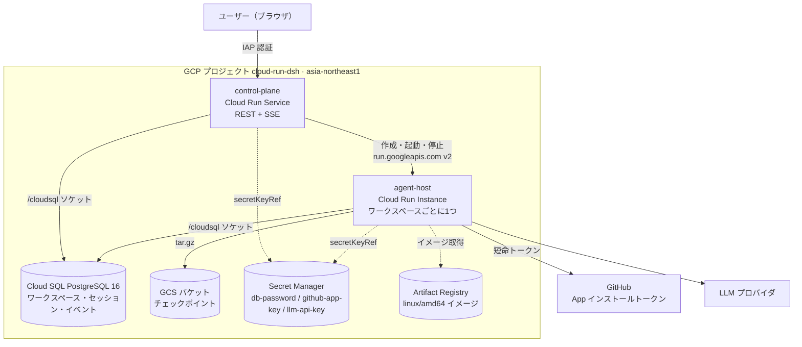
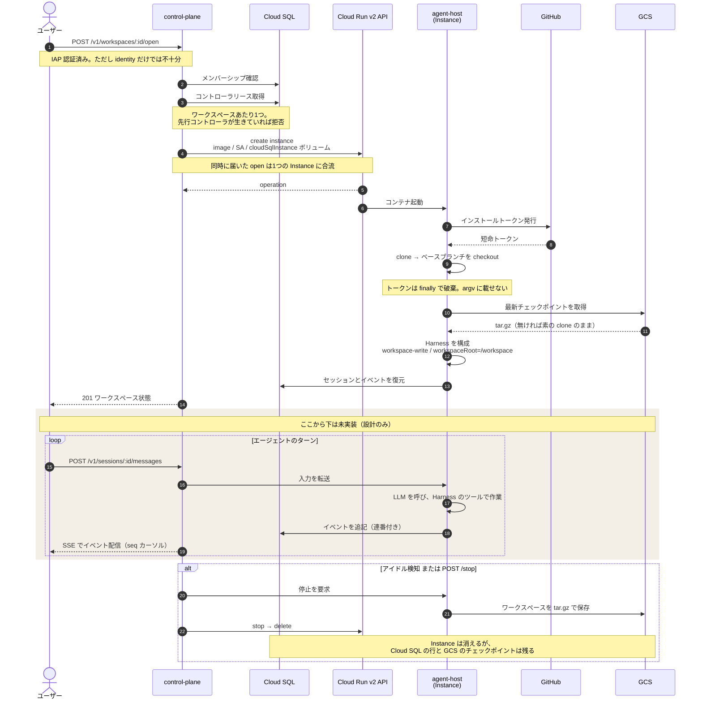

# Cloud Run DSH アーキテクチャ

ユーザーごとに隔離されたワークスペースを Cloud Run Instance 上で1つずつ動かすコーディングエージェント。
ファイルシステムのサンドボックスは DeepSeek Harness が担う。

> **現状は土台と閉じ込めまでで、エージェント本体（LLM 呼び出し）と 2 つのサービスを繋ぐ経路は未実装。**
> 残作業の全体像は [#31](https://github.com/mpppk/cloud-run-dsh/issues/31) を参照。

本書は 2026-09-03 に実プロジェクト `cloud-run-dsh` へ構築し、動作を確認したうえで撤収した内容に基づく。
確認の経過・実測ログ・途中で判明した制約の詳細は [立ち上げ作業報告](./bringup-report.md) にまとめてある。

| | |
|---|---|
| デプロイ単位 | 2 |
| Terraform リソース | 52 |
| リージョン | asia-northeast1 |
| DB | PostgreSQL 16 |

---

## 全体構成

control-plane は常駐かつ全ユーザー共有の Cloud Run Service。
agent-host は、開かれているワークスペース1つにつき1つの短命な Cloud Run Instance。



---

## 構成要素

上の図はデプロイ単位と GCP リソースを描いている。実装は、そのうち **control-plane と agent-host という
2 つのデプロイ単位の中**にパッケージとして収まっている。

### デプロイ単位（図に現れるもの）

| 図のノード | 実体 | 形態 |
|---|---|---|
| control-plane | `apps/control-plane` | Cloud Run Service。常駐、全ユーザー共有。 |
| agent-host | `apps/agent-host` | Cloud Run Instance。ワークスペース1つにつき1つ、短命。 |

### 内部パッケージ（図には現れない）

いずれも上の2つのどちらか、または両方の中で動くライブラリであって、独立してデプロイされるものではない。

| パッケージ | 動く場所 | 担当する図の要素 | 責務 |
|---|---|---|---|
| `cloud-run-instance-client` | 両方 | control-plane → Cloud Run v2 API → agent-host | Instances API の型付きクライアント。create / get / start / stop / delete と `validateOnly`。 |
| `session-persistence-postgres` | 両方 | → Cloud SQL（両方から出る矢印） | 追記専用のワークスペース・セッション・イベントストア。 |
| `workspace-checkpoint` | 両方 | agent-host → GCS | ワークスペースを ustar tar.gz にして保存・復元。復元時のパストラバーサル防御。 |
| `workspace-runtime` | 両方 | （状態機械。図には現れない） | 状態遷移、アイドル検知、open の合流。 |
| `controller-lease` | 両方 | （Cloud SQL 上のリース。図には現れない） | ワークスペースあたりコントローラ1つを保証。 |
| `observability` | 両方 | （横断。図には現れない） | 秘密情報を伏せる構造化ログ。 |
| `github-credential-broker` | agent-host のみ | agent-host → GitHub | App インストールトークンを短命で発行。PEM はホスト上に留まる。 |
| `cloud-run-sandbox` | agent-host のみ | （Instance 内部。図には現れない） | 名前付き Cloud Run Sandbox。run / exec / delete の argv 構築。 |
| `dsh-subprocess-cloud-run` | agent-host のみ | （Instance 内部。図には現れない） | 上のサンドボックスを backend とする Harness のサブプロセスプロバイダ。 |

> `cloud-run-instance-client` が両方に入っているのは、Instance を作るのは control-plane だが、
> agent-host も自分自身の停止のために同じクライアントを使うため。`workspace-checkpoint` も同様で、
> 実際に tar を書くのは agent-host、手動チェックポイントを起動するのは control-plane である。

---

## ワークスペースを開く流れ

関係する主体が多く、往復の順序そのものが仕様になっている。
**ただしこの図は設計であり、全段階が実装済みではない。**



### 実装状況

| 段階 | 実装 | GCP で実行 | 補足 |
|---|---|---|---|
| 認可（IAP + メンバーシップ） | あり | 未 | control-plane は本番デプロイしていない。 |
| コントローラリース | あり | 未 | ローカルでは検証済み。 |
| Instance の作成 | 半分 | API は実行 | クライアントは動くが、control-plane の `RuntimeRegistry` が未結線のため control-plane からは作れない（[#23](https://github.com/mpppk/cloud-run-dsh/issues/23)）。今回は API を直接叩いた。 |
| clone・checkout・チェックポイント復元 | あり | 未 | `bootstrap.ts` / `recovery.ts`。ENTRYPOINT を上書きしたため GCP では動いていない（[#24](https://github.com/mpppk/cloud-run-dsh/issues/24)）。 |
| Harness の構成 | あり | **実行** | `createHarnessComposition()` を Instance 内で直接呼び、拒否の挙動まで確認した。 |
| **入力の転送（control-plane → agent-host）** | **なし** | 未 | **両者を結ぶコードが存在しない**（[#22](https://github.com/mpppk/cloud-run-dsh/issues/22)）。control-plane は DB にイベントを書くだけ、agent-host は自分のゲートウェイで 202 を返すだけで、互いに通信しない。 |
| **エージェントのターン（LLM 呼び出し）** | **なし** | 未 | **リポジトリ内に LLM クライアントが1つも無い**（[#21](https://github.com/mpppk/cloud-run-dsh/issues/21)）。 |
| SSE 配信 | あり | 未 | 両サービスに実装があるが、流すイベントを作る側が無い。 |
| チェックポイントして停止 | あり | 未 | Instance の停止・削除 API のみ実行した。tar の保存は未実行（[#26](https://github.com/mpppk/cloud-run-dsh/issues/26)）。 |

> **現状は「土台と閉じ込めができていて、その上で動くエージェントがまだ無い」段階である。**
> インフラ、サンドボックス、永続化、状態機械は揃っているが、ユーザーの入力を受けて LLM を呼び
> ツールを使う中心部分と、2 つのサービスを繋ぐ経路が存在しない。

### 図に載らない規則

- **IAP だけでは認可しない。** IAP はユーザーが誰かを示すだけで、そのワークスペースのメンバーであるかは
  control-plane が別途確認する。
- **open は合流する。** 同じワークスペースへの同時 open が複数届いても、起動する Instance は1つ。
  2つ目以降は同じ起動処理の完了を待つ。
- **SSE のハートビートは活動ではない。** これを活動として数えると、画面を開いているだけで
  アイドル判定が永久に働かなくなる。
- **復元に失敗したワークスペースは入力を拒否する。** `RESTORE_FAILED` のままエージェントを動かすと、
  失われた状態の上に作業を積むことになる。

---

## API 面

| メソッド / パス | 用途 |
|---|---|
| `POST /v1/workspaces` | ワークスペースを作成する。id はサーバが採番する。 |
| `GET /v1/workspaces/:id` | 状態を取得する。 |
| `POST /v1/workspaces/:id/open` | Instance を起動する（同時実行は合流）。 |
| `POST /v1/workspaces/:id/stop` | チェックポイントを取って停止する。 |
| `POST /v1/workspaces/:id/checkpoints` | 手動チェックポイント。 |
| `POST /v1/workspaces/:id/controller/{acquire,heartbeat,release}` | コントローラリースの取得・延長・解放。 |
| `GET` / `POST /v1/workspaces/:id/sessions` | セッションの一覧と作成。 |
| `POST /v1/sessions/:id/messages` | エージェントへの入力。フィールド名は `content`。 |
| `GET /v1/sessions/:id/events` | SSE ストリーム。seq カーソルで再生できる。 |
| `POST /v1/sessions/:id/approvals/:approvalId` | 承認要求への応答。 |
| `POST /v1/sessions/:id/cancel` | 実行中のターンを中断する。 |
| `GET /healthz` · `/readyz` | ヘルスとレディネス。 |

---

## データと状態

**ワークスペース状態**
`STARTING` → `RUNNING` → `CHECKPOINTING` → `STOPPING` → `STOPPED`。
復元経路として `RESTORING` と `RESTORE_FAILED` を持つ。`RESTORE_FAILED` はエージェントへの入力を拒否する。

**コントローラリース**
ワークスペースあたり1つ。ハートビート15秒、失効45秒。単一書き手を保証し、
複数のコントローラが同じワークスペースを同時に動かすことを防ぐ。

**セッションとイベント**
Cloud SQL 上の追記専用ストア。イベントには連番が付き、SSE の再接続時はこのカーソルから再生する。
SSE のハートビートは意図的に「活動」として数えない（数えるとアイドル判定が働かなくなる）。

**チェックポイント**
ワークスペースを ustar 形式の tar.gz にして GCS へ。復元時にパストラバーサルを防ぐ。
バケットはバージョニング有効で、非現行バージョンは30日で削除される。

**永続性の境界**
Instance は使い捨て。ワークスペースの中身はチェックポイント、会話とイベントは Cloud SQL に残る。
Instance を削除しても、次に開いたときに同じ状態から再開できる。

---

## ネットワーク構成

Cloud Run Instance には VPC への接続手段が無い。したがって以下は選択肢の中から選んだのではなく、
現時点で成立する唯一の構成である。

**Cloud SQL への接続**
`volumes[].cloudSqlInstance` を `/cloudsql` にマウントする、Cloud Run のネイティブ統合を使う。
必要なのは実行サービスアカウントの `roles/cloudsql.client` だけで、
**Auth Proxy のサイドカーも Serverless VPC Access コネクタも使わない**。

**Cloud SQL の IP**
プライベート IP に加えて**公開 IPv4 を持つ**。ネイティブ統合が公開アドレスに接続するため、
公開 IP を外すと Instance から到達できなくなる。`db_enable_public_ip` で切り替え、既定は `false`。
立ち上げ用プロファイル（`infra/terraform/profiles/minimal.tfvars`）で明示的に有効化する。

**アクセス制御**
`authorized_networks` は**空**。Cloud Run Instance は Google の共有アドレスプールから出ていくため、
それを通せる許可リストは実質 `0.0.0.0/0` になり意味を持たない。
認可は IAM と短命クライアント証明書が担う。

**VPC とピアリング**
Cloud SQL のプライベート IP のために専用 VPC と Service Networking のピアリングを持つ。
Cloud Run 側からここを通る経路は無い。サブネットも VPC コネクタも作らない。

**Instance の公開範囲**
既定で invoker IAM が効く。未認証のリクエストは 403 で弾かれ、ID トークンが必要になる。
ポートは 8080、ingress は `INGRESS_TRAFFIC_ALL`。

---

## セキュリティモデル

### ファイルシステムの閉じ込め

強制しているのは公開されている DeepSeek Harness のパッケージ（`0.1.2-rc.1` に厳密ピン）であって、
手元の再実装ではない。`workspace-write` モードでの実効ポリシは次のとおり。

| モデルからの操作 | 結果 | 担保 |
|---|---|---|
| `/workspace` 配下への読み書き | 許可 | — |
| `/etc`、`/app`、`/home`、`/var/tmp` への書き込み | 拒否 | fs-sandbox |
| `../` によるワークスペース外への脱出 | 拒否 | fs-sandbox |
| シンボリックリンク経由の脱出 | 拒否 | fs-sandbox |
| `/tmp` への書き込み | **許可** | upstream の仕様。`/var/tmp` は不可 |
| 一度も read していないファイルの上書き | 拒否 | fs-observation-policy |
| read 後、裏で変更されたファイルへの write | 拒否 | fs-observation-policy |
| 検索 | 許可 | tool-fs-search。argv 固定でフラグ注入不可 |
| 任意コマンドの実行 | 到達不能 | アダプタは filesystem と search のシームのみ公開 |

> `/tmp` が書けるのは upstream の `workspace-write` の定義である。
> ワークスペース外の**永続的な**書き込みは拒否されるうえ、Instance は短命で
> プロセス終了時に `/tmp` ごと消えるため、封じ込めは成立している。
> 仕様書 §6.2 とアダプタのコメントも実態に合わせて訂正済み
> （[#30](https://github.com/mpppk/cloud-run-dsh/issues/30) で判断・対応）。
> 測定の詳細は [立ち上げ作業報告](./bringup-report.md) の G8 を参照。

### 資格情報の扱い

- GitHub App の PEM はホスト上にのみ存在する。ディスクに書かれず、サンドボックスにも渡らない。
- clone に使うトークンは短命で、`finally` で破棄され、argv には載らない。
- DB パスワードは `secretKeyRef` で注入する。Instance の spec には現れない。
- サービスアカウント鍵は作らない。Terraform に書けないようテストで禁じている。

### ID とアクセス権

| サービスアカウント | 付与 |
|---|---|
| `dev-dsh-agent-host` | `cloudsql.client`、logging、monitoring、3つのシークレットに対する `secretAccessor`、チェックポイントバケットの object admin。 |
| `dev-dsh-control-plane` | 上記に加えて `run.admin` と agent-host への `actAs`。Instance を作るために必要。 |
| `ai-agent` | ローカルの AI 作業用オペレータ ID。`run.admin` + `artifactregistry.writer` とスコープ付き `actAs`。ユーザー管理鍵は持たない。 |

> **これは least-privilege ではない。** `ai-agent` になりすませる者は、agent-host *として*動くコンテナを
> デプロイし、全てのシークレットとチェックポイントバケットを読める。単一オーナーのプロジェクトとして
> 受容している。`ai_agent_impersonators` にメンバーを足すのは、内容を理解したうえでの判断であって、
> 日常的な操作ではない。詳細は [gcp-ai-agent-impersonation.md](./gcp-ai-agent-impersonation.md)。

### テストで守っているガードレール

`tests/terraform_baseline.test.ts` が以下を強制する。

- Terraform に `google_service_account_key` を書けない。
- `ai_agent_project_roles` を広げられない。プロジェクト全体の `serviceAccountUser` も与えられない。
- `ipv4_enabled` は変数に配線されていなければならず、その変数の既定は `false`。
- `edition` は `var.db_edition` に配線され、既定は `ENTERPRISE`。

いずれのアサーションも、**意図的に設定を壊してテストが落ちることを確認**してから採用している。
この習慣があるのは、以前これらの1つが設定ではなく*コメント*に一致して通っていたためである。

---

## ビルドとデプロイ

**イメージ**
agent-host と control-plane の2つ。いずれも bun ベースの多段ビルドで、非 root（uid 10001）で動く。
`/workspace` のみが書き込み可能。

**アーキテクチャ**
**`linux/amd64` のみ。** Cloud Run は arm64 を実行できないので、GCP 向けのビルドには必ず
`--platform linux/amd64` を付ける。

**型検査**
イメージのビルド中には行わない。CI が担う。
（arm64 ホストからのクロスビルドでは qemu 上で bun が異常終了するため。）

**CI**
`.github/workflows/ci.yml` が全ての PR で、型検査・テスト・`terraform fmt` と `validate`（オフライン）・
ネイティブ amd64 ランナーでの両イメージのビルドを実行する。

**Terraform**
ローカル state（backend 未設定）。ADC 無しで動かせる — `GOOGLE_OAUTH_ACCESS_TOKEN` に
アクセストークンを入れればよい。DB パスワードは Secret Manager から読むが、初回のみ
`var.db_password` で与える二段構えになっている。

**Terraform が持つのは静的な土台まで。Cloud Run Instances は管理外と決めている。**
Instance はワークスペースごとの短命リソースで、control-plane が実行時に create / delete
するため、宣言的管理に載せると `terraform plan` が恒常的に drift で汚れる。
API 有効化・Cloud SQL・GCS・Secret・IAM・サービスアカウントが Terraform の境界であり、
Instance のライフサイクルは control-plane の `InstanceRuntime` アダプタと
[deployment-runbook](./deployment-runbook.md) Step 5 が担う。
判断の経緯は [ADR-0001](./adr/0001-instances-outside-terraform.md) に記録している
（[#28](https://github.com/mpppk/cloud-run-dsh/issues/28) で決定済み）。

---

## リソース作成と動作確認の手順

実際に通した順序。リポジトリ内の正式な手順書は [deployment-runbook.md](./deployment-runbook.md) で、
ここはそれを実行可能な最短経路に圧縮したもの。**課金が発生する段階には印を付けてある。**

### 00. 前提を整える（無料）

Terraform は ADC を使わず、アクセストークンを環境変数で受け取る。`ai-agent` は `serviceusage` 権限を
持たないので、API 有効化と apply はオーナーアカウントで行う。

```bash
gcloud config set project cloud-run-dsh
export GOOGLE_OAUTH_ACCESS_TOKEN="$(gcloud auth print-access-token)"
```

### 01. API を有効化する（無料）

`apis.tf` が管理する分は apply が有効化するが、`compute` と `cloudresourcemanager` は
google provider 自身のブートストラップ依存なので、初回は事前に必要になる。

```bash
gcloud services enable \
  cloudresourcemanager.googleapis.com \
  compute.googleapis.com \
  run.googleapis.com
```

### 02. 変数ファイルを用意する（無料）

初回 apply の時点では `db-password` シークレットにバージョンが無いため、パスワードを直接与える
二段構えになっている（`var.db_password` が `null` でなければ Secret Manager を読まない）。
**argv にもシェル履歴にも載せないこと。**

```bash
umask 077
openssl rand -base64 27 | tr -d '\n=' > ~/.dsh_dbpw

cat > ~/.dsh.tfvars <<EOF
project_id             = "cloud-run-dsh"
ai_agent_impersonators = ["user:you@example.com"]
db_enable_public_ip    = true
db_password            = "$(cat ~/.dsh_dbpw)"
EOF
chmod 600 ~/.dsh.tfvars
```

`db_enable_public_ip = true` は必須。これを落とすと apply は成功するが、Instance から Cloud SQL に
到達できない。最小構成で立ち上げるだけなら `profiles/minimal.tfvars` を併用する。

### 03. plan で確認してから apply する（**ここから課金**）

Cloud SQL の作成に10〜15分かかる。ここを越えると、何も動かしていなくても課金が始まる。

```bash
cd infra/terraform
terraform init -input=false
terraform plan  -input=false -var-file=~/.dsh.tfvars
# → Plan: 52 to add, 0 to change, 0 to destroy.

terraform apply -input=false -var-file=~/.dsh.tfvars
# → Apply complete! Resources: 52 added.
```

既にサービスアカウントが手動で作られている場合は、先に state へ取り込まないと 409 で衝突する
（`terraform import google_service_account.ai_agent …`）。

### 04. シークレットを投入する（無料）

定常状態では Terraform は Secret Manager からパスワードを読む。apply 後にバージョンを追加し、
以降は `db_password` を渡さなくてよくなる。**シークレットのバージョンは destroy で消えるので、
作り直すたびに必要。**

```bash
gcloud secrets versions add db-password --data-file=~/.dsh_dbpw
# GitHub App と LLM の鍵も同様に（--data-file で、-d は使わない）
```

### 05. イメージをビルドして push する（保管料）

**`--platform linux/amd64` は必須。** arm64 のホストで省略すると arm64 イメージができ、
Cloud Run は実行できない。

```bash
gcloud auth print-access-token | docker login -u oauth2accesstoken \
  --password-stdin https://asia-northeast1-docker.pkg.dev

IMG=asia-northeast1-docker.pkg.dev/cloud-run-dsh/agent-host/agent-host:v1
docker build --platform linux/amd64 -f apps/agent-host/Dockerfile -t "$IMG" .
docker image inspect "$IMG" --format '{{.Os}}/{{.Architecture}}'
# → linux/amd64  ← ここを必ず目視する
docker push "$IMG"
```

### 06. Instance のリクエストを空撃ちで検証する（無料）

`validateOnly=true` は 200 とデフォルト補完済みの Instance を返し、**何も作らない**。
前後で list が空のままであることを確認できる。

```bash
TOK=$(gcloud auth print-access-token)
BASE=https://run.googleapis.com/v2/projects/cloud-run-dsh/locations/asia-northeast1

cat > /tmp/inst.json <<'JSON'
{
  "containers": [{
    "name": "agent-host",
    "image": "asia-northeast1-docker.pkg.dev/cloud-run-dsh/agent-host/agent-host:v1",
    "env": [{ "name": "DB_PASSWORD",
              "valueSource": { "secretKeyRef": { "secret": "db-password", "version": "latest" } } }],
    "volumeMounts": [{ "name": "cloudsql", "mountPath": "/cloudsql" }],
    "resources": { "limits": { "cpu": "1", "memory": "1Gi" } }
  }],
  "volumes": [{ "name": "cloudsql",
                "cloudSqlInstance": { "instances": ["cloud-run-dsh:asia-northeast1:dev-dsh-pg"] } }],
  "serviceAccount": "dev-dsh-agent-host@cloud-run-dsh.iam.gserviceaccount.com",
  "restartPolicy": "NEVER"
}
JSON

curl -sS -X POST -H "Authorization: Bearer $TOK" -H "Content-Type: application/json" \
  --data @/tmp/inst.json \
  "$BASE/instances?instanceId=dsh-verify&validateOnly=true"
# → 200。エラーが返ればここで止める（まだ何も作られていない）
```

`instanceId` はクエリパラメータであることに注意。ボディの `name` は create では無視される。

### 07. Instance を作って起動を確認する（従量）

```bash
curl -sS -X POST -H "Authorization: Bearer $TOK" -H "Content-Type: application/json" \
  --data @/tmp/inst.json "$BASE/instances?instanceId=dsh-verify"

curl -sS -H "Authorization: Bearer $TOK" "$BASE/instances/dsh-verify" \
  | python3 -c 'import json,sys; d=json.load(sys.stdin); print(d["terminalCondition"])'
```

期待される出力:

```
{"type": "Running", "state": "CONDITION_SUCCEEDED",
 "message": "Started instance in 14.14s."}
```

`CONDITION_RECONCILING` は起動途中、`CONDITION_FAILED` は失敗。**状態を見ずに次へ進まないこと。**

### 08. コンテナのログで中身を確認する（無料）

```bash
gcloud logging read \
  'resource.type="cloud_run_instance"
   AND resource.labels.instance_name="dsh-verify"' \
  --limit 30 --freshness=15m --format="value(textPayload)"
```

確認したい観点は、DB に到達できるか（`/cloudsql` にソケットが生えているか）、Harness がワークスペース外への
書き込みを拒否するか、検索が動くか。`SFEClient is nil` が出たら公開 IP が無効になっている。

> **この手順で確認できるのは、土台と Harness までである。**
> 06 の JSON で `command` を指定すると Dockerfile の `ENTRYPOINT` を上書きするため、
> `apps/agent-host/src/index.ts` は動かない。アプリ本体（ゲートウェイ、clone・復元、リース、
> チェックポイント）を GCP 上で確かめたい場合は `command` を外し、必須の環境変数を全て与えたうえで
> 起動すること（[#24](https://github.com/mpppk/cloud-run-dsh/issues/24)）。

### 09. 撤収する（課金を止める）

**順序が重要。** Instance を先に消し、バケットを空にしてから destroy する。バケットにオブジェクトが
残っていると `force_destroy = false` のため destroy が失敗し、**課金が止まらない。**

```bash
curl -sS -X DELETE -H "Authorization: Bearer $TOK" "$BASE/instances/dsh-verify"
curl -sS -H "Authorization: Bearer $TOK" "$BASE/instances"
# → {} になるまで待つ

bun run teardown:empty-bucket -- --yes
terraform destroy -input=false -var-file=~/.dsh.tfvars
# → Destroy complete! Resources: 49 destroyed.
```

### 10. 残っていないことを確かめる（無料）

「destroy が成功した」と「課金対象が残っていない」は別の主張である。後者を直接見る。

```bash
gcloud sql instances list
gcloud storage buckets list
gcloud artifacts repositories list
gcloud compute networks vpc-access connectors list --region asia-northeast1
curl -sS -H "Authorization: Bearer $TOK" "$BASE/instances"
curl -sS -H "Authorization: Bearer $TOK" "$BASE/services"
```

サービスアカウントを Terraform の state に取り込んでいた場合、destroy はそれらも削除する。
`gcloud config auth/impersonate_service_account` が `ai-agent` を指していると、以降すべての
gcloud 呼び出しが失敗するので解除する。

---

## 未完成の箇所

現時点で結線されていない、あるいは動作を確認していない部分。
いずれも Issue として登録済み。全体像と進める順序は
[#31](https://github.com/mpppk/cloud-run-dsh/issues/31) を参照。

| 箇所 | 状態 | Issue |
|---|---|---|
| **エージェントのターン（LLM 呼び出し）** | **未実装。** リポジトリ内に LLM クライアントが存在しない。 | [#21](https://github.com/mpppk/cloud-run-dsh/issues/21) |
| **control-plane と agent-host の連携** | **未実装。** 両者を繋ぐコードが無く、同じ DB を共有する別々のサービスとして並んでいる。 | [#22](https://github.com/mpppk/cloud-run-dsh/issues/22) |
| control-plane の `RuntimeRegistry` 本番ファクトリ | 未結線。専用エラーで即座に失敗し、起動時に警告を出し、`/readyz` は 503 を返す。 | [#23](https://github.com/mpppk/cloud-run-dsh/issues/23) |
| agent-host 本体の GCP 上での起動 | 未実行（ENTRYPOINT を上書きしていたため）。 | [#24](https://github.com/mpppk/cloud-run-dsh/issues/24) |
| Cloud SQL へのマイグレーション実行 | 実 runner を通していない。 | [#25](https://github.com/mpppk/cloud-run-dsh/issues/25) |
| 実 GCS でのチェックポイント保存・復元 | 未実行。 | [#26](https://github.com/mpppk/cloud-run-dsh/issues/26) |
| GitHub App | 未登録。ユーザー側の作業。 | [#31](https://github.com/mpppk/cloud-run-dsh/issues/31) |
| IAP ブランド / ロードバランサ | 未作成。一度作ると削除できないため見送っている。`iap_support_email` を与えたときのみ作られる。 | — |

> control-plane は自分の未完成さについて意図的に正直に振る舞う。仕事ができないデプロイが自分を
> ready と称するべきではないため、ランタイムレジストリが未結線の間 `/readyz` は 503 を返し続ける。

---

## 運用上の特性

- **コストの支配要因は Cloud SQL。** 何も動いていなくても課金される。Instance は従量課金で、金額はセント単位。
- **API の有効化は無料。** 課金されるのはリソースだけ。
- **支払う前に検証できる。** v2 の `create` は `validateOnly=true` を受け付け、デフォルト補完済みの
  Instance を返しつつ何も作らない。
- **撤収の順序が重要。** チェックポイントバケットはバージョニング有効かつ `force_destroy = false` なので、
  オブジェクトが残っていると `terraform destroy` が失敗する。撤収が失敗するとは、課金が止まらないということ。
  先に空にする（`--yes` ガード付きのスクリプトがある）。
- **ピアリングは `deletion_policy = "ABANDON"`。** destroy 後も残り、次回の apply に影響する。
- **シークレットのバージョンは destroy で消える。** 作り直すたびに DB パスワードを入れ直す。

コストの内訳は [cost.md](./cost.md) を参照。
